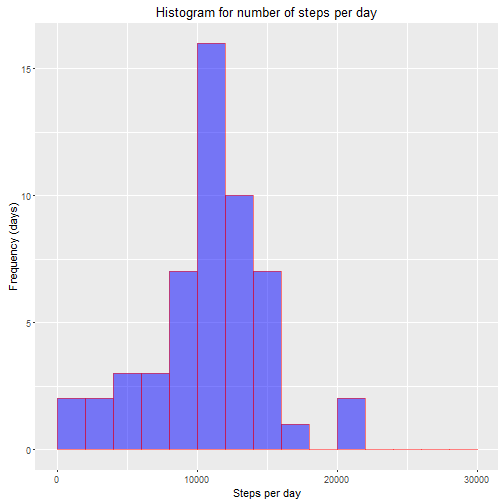
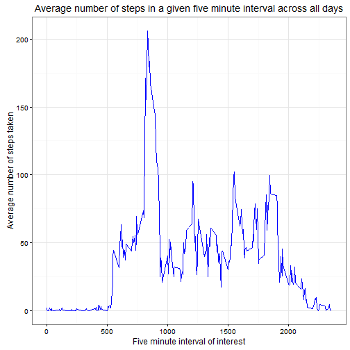
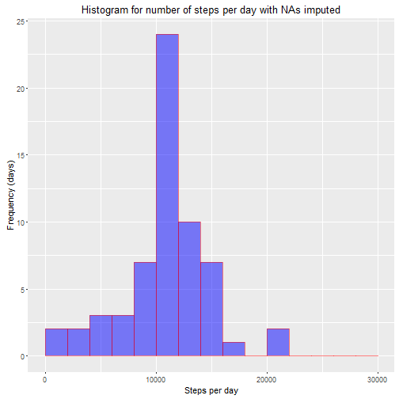
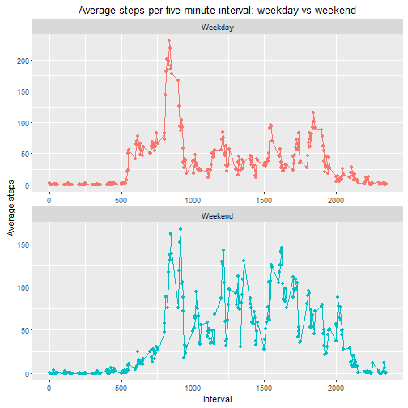

```r
#Data analysis and plotting script for Reproducible Research Course Project #1

#Load data
act <- read.csv('activity.csv')

#Load required libraries
library(dplyr)
```

```
## 
## Attaching package: 'dplyr'
```

```
## The following objects are masked from 'package:stats':
## 
##     filter, lag
```

```
## The following objects are masked from 'package:base':
## 
##     intersect, setdiff, setequal, union
```

```r
library(ggplot2)
```

```
## Warning: package 'ggplot2' was built under R version 3.2.3
```

```r
#Group the data by day and sum the steps per day and add a weekday column
b <- act %>% group_by(date) %>% summarise(SPD = sum(steps))
b <- b %>% mutate(WkDay = weekdays(as.Date(date), TRUE))

#Group the data by 5-min interval and average the steps for each interval
c <- act %>% group_by(interval) %>% summarise(avgSPI = mean(steps, na.rm=TRUE))
```


```r
#Which 5-min interval had the greatest average number of steps?
c$interval[match(max(c$avgSPI), c$avgSPI)] #Interval 835
```

```
## [1] 835
```

```r
#Determine the number of NA values in each column of the original data (act)
naSteps <- sum(is.na(act$steps))
naDates <- sum(is.na(act$date))
naInts <- sum(is.na(act$interval))
naTotal <- sum(naSteps, naDates, naInts) #2304 na values total

naSteps
```

```
## [1] 2304
```

```r
naDates
```

```
## [1] 0
```

```r
naInts
```

```
## [1] 0
```

```r
naTotal
```

```
## [1] 2304
```

```r
#Impute the missing values; replace missing values with the mean steps per day or per interval
imputedData <- act
imputedData$steps <- ifelse(is.na(imputedData$steps), c$avgSPI, imputedData$steps)

#Group the data by day and sum the steps per day and add a weekday column
d <- imputedData %>% group_by(date) %>% summarise(SPD = sum(steps))
d <- d %>% mutate(WkDay = weekdays(as.Date(date), TRUE))

#Create vectors of weekdays and weekend days so that we can group the data accordingly
weekdays <- c('Mon','Tue','Wed','Thu','Fri')
weekends <- c('Sat', 'Sun')

#Create a new column indicating whether the date is a weekend or weekday
d <- mutate(d, DayType = WkDay) %>%
     mutate(DayType=replace(DayType, is.element(WkDay, weekdays), 'Weekday')) %>%
     mutate(DayType=replace(DayType, is.element(WkDay, weekends), 'Weekend'))

#Add weekend or weekday markers for the average steps per interval dataset
e <- imputedData %>% mutate(WkDay = weekdays(as.Date(date), TRUE))

e <- mutate(e, DayType = WkDay) %>%
     mutate(DayType=replace(DayType, is.element(WkDay, weekdays), 'Weekday')) %>%
     mutate(DayType=replace(DayType, is.element(WkDay, weekends), 'Weekend'))

f <- e %>% group_by(DayType, interval) %>% summarise(SPI = mean(steps))
```


```r
#Calculate the mean and median steps per day
meanSPDimputed <- mean(d$SPD, na.rm=TRUE)
medianSPDimputed <- median(d$SPD, na.rm=TRUE)
print(meanSPDimputed)
```

```
## [1] 10766.19
```

```r
print(medianSPDimputed)
```

```
## [1] 10766.19
```
#Create a histogram of the number of steps per day

```
## Warning: Removed 8 rows containing non-finite values (stat_bin).
```



#Calculate the mean and median steps per day

```r
meanSPD <- mean(b$SPD, na.rm=TRUE)
medianSPD <- median(b$SPD, na.rm=TRUE)
print(meanSPD)
```

```
## [1] 10766.19
```

```r
print(medianSPD)
```

```
## [1] 10765
```

#Create a time series plot showing the avg steps taken during each 5-min interval


#Create a histogram of the number of steps per day with missing values imputed


#Weekday vs Weekend patterns


